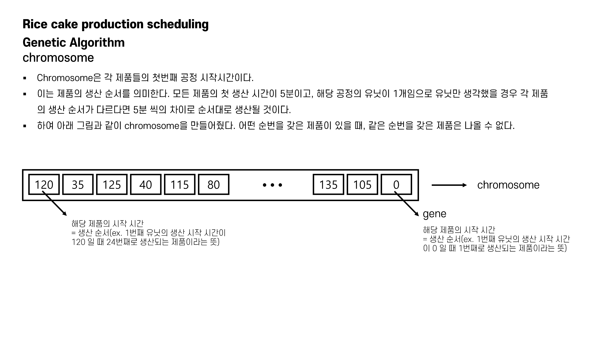

# 2022-2_ST_Capstone_Design 
2022년 2학기 ST 캡스톤 디자인 수업 자료입니다.

### 자료 : [Algoritgm Description.](Genetice_Algorithm_Architecture.pdf)

## PROBLEM DESCRIPTION

## METHOD

## EXPERIMENT

## CONCLUSION

